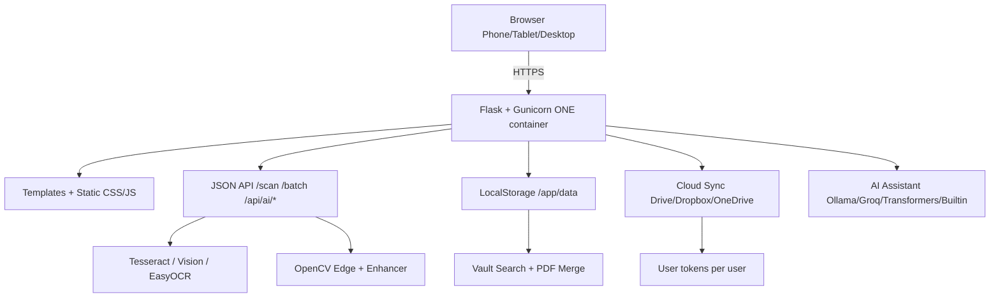
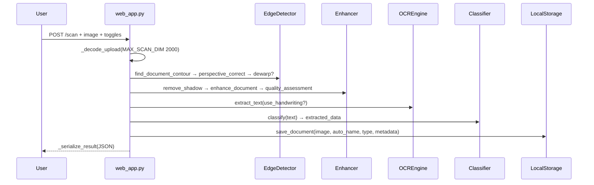

# AI Scanner — Project Documentation

> **WebEnoid Internship Project** — Developed by **Om Prakash Suthar (WebEnoid Intern)**  
> Internship Period: **19 July 2026 – 05 September 2026** | Rating: **5.0** | Duration: **2–3 Months**  
> **Repo:** https://github.com/OPBSUTHAR/ai-scanner | **Live Demo:** https://ai-scanner-fnjh.onrender.com/ | **Branch:** `main` | **Tests:** 73/73 ✅

<p align="center">
  
</p>

<p align="center">
  <a href="https://github.com/OPBSUTHAR/ai-scanner"></a>
  
  
  
  
  
</p>

---

## 📑 Table of Contents

- [1. Overview](#1-overview)
- [2. Live Demo & Links](#2-live-demo--links)
- [3. Tech Stack](#3-tech-stack)
- [4. Architecture](#4-architecture)
- [5. Project Structure](#5-project-structure)
- [6. Quick Start](#6-quick-start)
- [7. Configuration](#7-configuration)
- [8. Features — Interactive](#8-features--interactive)
- [9. API Reference](#9-api-reference)
- [10. Frontend Guide](#10-frontend-guide)
- [11. Backend & Pipeline](#11-backend--pipeline)
- [12. Storage & Cloud Sync](#12-storage--cloud-sync)
- [13. AI Assistant](#13-ai-assistant)
- [14. Camera & Mobile](#14-camera--mobile)
- [15. Testing](#15-testing)
- [16. Deployment](#16-deployment)
- [17. Security](#17-security)
- [18. Troubleshooting](#18-troubleshooting)
- [19. Timeline & Changelog](#19-timeline--changelog)
- [20. Submission Notes](#20-submission-notes)

---

## 1. Overview

<details open>
<summary><b>Click to expand overview</b></summary>

**AI Scanner** is a **monolithic Flask application** where one Docker container serves both the web UI and the JSON API. Any phone, tablet, or desktop browser becomes an intelligent scanner.

**Pipeline:** `Upload / Camera → Edge Detection & Perspective Correction → Enhancement (shadow removal, CLAHE, sharpen) → OCR (Tesseract / Vision / EasyOCR) → Classification → Auto-naming → Storage → Search & Vault → Cloud Sync → AI Assistant`

- Works on **any device** via browser — no app install.
- **Camera live-view** on HTTPS; **native camera fallback** on HTTP / old browsers via `<input capture>`.
- **Vault is ground truth** — AI never invents files.
- Completed as **WebEnoid Internship deliverable**, solely by **Om Prakash Suthar** (all 110+ commits `OMPRAKASH SUTHAR`).

</details>

---

## 2. Live Demo & Links

| Resource | URL |
|---|---|
| **Live App (Render)** | https://ai-scanner-fnjh.onrender.com/ |
| **Login** | https://ai-scanner-fnjh.onrender.com/login |
| **Health: OCR** | https://ai-scanner-fnjh.onrender.com/api/ocr/status |
| **Health: AI** | https://ai-scanner-fnjh.onrender.com/api/ai/status |
| **GitHub Repo** | https://github.com/OPBSUTHAR/ai-scanner |
| **Full Report** | [`FULL_PROJECT_REPORT.md`](FULL_PROJECT_REPORT.md) |
| **Deploy Guide** | [`DEPLOYMENT_GUIDE.md`](DEPLOYMENT_GUIDE.md) |
| **Short Notes** | [`PROJECT_DESCRIPTION_AND_NOTES.txt`](PROJECT_DESCRIPTION_AND_NOTES.txt) |

> **Verified 05 Sep 2026 08:21 UTC:** `GET /` 200 (2874 B), `POST /scan` 200 `invoice 0.714 $234.50`, `POST /api/ai/chat` grounded `0 documents` (empty vault), `GROQ_API_KEY` enabled (`cloud` engine).

---

## 3. Tech Stack

| Layer | Tech |
|---|---|
| **Backend** | Python 3.11/3.13, Flask, Gunicorn, Jinja2 |
| **Image** | OpenCV 4.8+, scikit-image, SciPy, Pillow, NumPy |
| **OCR** | Tesseract 5.5 (auto-detected), Google Cloud Vision, EasyOCR (PyTorch CPU), pytesseract |
| **AI** | Ollama (llama3.2/phi3/gemma2) → Groq `llama-3.3-70b` (free) → Transformers `google/flan-t5-small` → Built-in regex helper |
| **QR** | pyzbar (`libzbar0t64`), OpenCV `QRCodeDetector` |
| **Storage** | LocalStorage (`data/documents/{type}/{name}` + `metadata/{stem}.json`), reportlab, img2pdf, office→PDF (python-docx/openpyxl) |
| **Cloud** | google-api-python-client, `google-auth`, `dropbox>=11.36`, `msal` (OneDrive/Graph) |
| **Security** | `cryptography` Fernet, path-traversal guard `_resolve_within` |
| **Frontend** | Vanilla JS (no framework), HTML, CSS — Classic Archive theme (Playfair Display, Lora, JetBrains Mono, Cormorant Garamond, Lucide icons) |
| **Deploy** | Docker `python:3.11-slim-trixie` + `tesseract-ocr` + `libzbar0t64` + `libgl1`, `railway.json`, `render.yaml`, `startup.sh` |
| **Testing** | pytest 9.1, Flask `test_client`, 73 tests |

---

## 4. Architecture

### 4.1 High-Level



### 4.2 Request Flow



> **Why monolith?** Vercel/Netlify fail: 10s serverless timeout (OCR needs 120s), ephemeral disk, no custom `tesseract`/`zbar` deps, 250 MB limit (torch exceeds). One Docker container avoids splits.

---

## 5. Project Structure

<details>
<summary><b>Click to view tree</b></summary>

```
repo root (GitHub landing)
├── README.md                     # GitHub entrypoint (6754 B)
├── PROJECT_DOCUMENTATION.md      # ← YOU ARE HERE (interactive)
├── FULL_PROJECT_REPORT.md        # Inch-by-inch 19 Jul–05 Sep report
├── PROJECT_DESCRIPTION_AND_NOTES.txt # Portal paste-ready notes
├── AGENTS.md                     # Agent memory + push-to-deploy rule
├── .gitignore                    # Root (scoped JSON, !railway.json)
├── DEPLOYMENT_GUIDE.md           # Render/Railway/Coolify steps
├── DEPLOY_STEPS.txt              # Tick-box checklist
├── PROJECT_STRUCTURE.txt         # Generated tree
├── generate_project.py           # Initial scaffolder (152 lines)
├── end_of_day_report_*.txt       # 10 daily logs
└── ai_scanner/                   # *** APP ROOT — set as Root Directory ***
    ├── Dockerfile                # python:3.11-slim-trixie + deps
    ├── .dockerignore
    ├── railway.json              # DOCKERFILE builder, healthcheck /
    ├── render.yaml               # Oregon free, env vars
    ├── startup.sh                # gunicorn --bind $PORT
    ├── requirements.txt / requirements-dev.txt
    ├── .env.example / .gitignore (now !railway.json)
    ├── PROJECT_STATUS.md
    ├── test_invoice.png
    ├── config/{settings.py,app_config.json}
    ├── src/
    │   ├── web_app.py            # 1,854 lines — all endpoints
    │   ├── main.py               # AIScanner pipeline
    │   ├── ai_assistant/engine.py (22.8 KB) — 4-engine chain
    │   ├── camera/{capture.py,bluetooth_camera.py}
    │   ├── edge_detection/detector.py
    │   ├── enhancement/enhancer.py
    │   ├── ocr/ocr_engine.py
    │   ├── classification/classifier.py
    │   ├── storage/{local_storage.py,cloud_sync.py}
    │   ├── utils/{auto_naming,qr_detection,search,key_manager,doc_converter,bluetooth_qr}.py
    │   ├── templates/{index.html,login.html,bt_cam.html}
    │   └── static/{css/{style,login}.css, js/{app,login}.js, images/logo.svg}
    ├── data/ (gitignored — documents, metadata, uploads, temp)
    ├── tokens/ (gitignored — per-user cloud tokens)
    └── tests/ (73 tests)
```

</details>

---

## 6. Quick Start

<details open>
<summary><b>Local development</b></summary>

```powershell
# 1. Clone
git clone https://github.com/OPBSUTHAR/ai-scanner.git
cd ai-scanner

# 2. Venv + deps (Windows)
python -m venv ai_scanner\.venv
Set-ExecutionPolicy -Scope Process -ExecutionPolicy RemoteSigned
.\ai_scanner\.venv\Scripts\Activate.ps1
pip install -r ai_scanner/requirements.txt
pip install -r ai_scanner/requirements-dev.txt  # tests

# Linux/Mac
# python3 -m venv ai_scanner/.venv && source ai_scanner/.venv/bin/activate
# pip install -r ai_scanner/requirements.txt

# 3. Env (optional — scanner works without keys)
copy ai_scanner\.env.example ai_scanner\.env   # fill if using cloud

# 4. Run
python -m src.web_app          # from ai_scanner/  → http://localhost:5000
# or: python -m ai_scanner.src.web_app  (from repo root)
# double-click ai_scanner/run.bat on Windows

# 5. Tests
pytest ai_scanner/tests/ -v    # 73 passed
```

**Prerequisites:** Python 3.10+, Tesseract OCR (Windows installer auto-detected; Docker handles `tesseract-ocr`), Git. QR needs `libzbar0` (Docker) / `zbar-tools` (Mac).

</details>

<details>
<summary><b>Docker</b></summary>

```bash
cd ai_scanner
docker build -t ai-scanner .
docker run -p 8000:8000 ai-scanner
# → http://localhost:8000 (login → Scanner → Vault)
```

</details>

---

## 7. Configuration

| File | Purpose |
|---|---|
| `ai_scanner/.env.example` | Template — copy to `.env`, fill keys |
| `ai_scanner/.env` | **Gitignored** — secrets live here |
| `ai_scanner/config/app_config.json` | Runtime toggles: `{"ai":{"auto_summarize":true}}` |

**Env vars (selected):**

| Key | Required? | Notes |
|---|---|---|
| `GOOGLE_DRIVE_CLIENT_ID/SECRET` | Optional | Drive sync |
| `GOOGLE_VISION_API_KEY` or `GOOGLE_APPLICATION_CREDENTIALS` | Optional | Cloud OCR |
| `DROPBOX_APP_KEY/SECRET/ACCESS_TOKEN` | Optional | Dropbox |
| `ONEDRIVE_CLIENT_ID/SECRET/TENANT_ID` | Optional | OneDrive |
| `GROQ_API_KEY` | Optional (free) | Hosted AI quality (`cloud` engine) |
| `OLLAMA_HOST`, `OLLAMA_MODEL`, `AI_LOCAL_MODEL` | Optional | Local AI tuning |
| `APP_ENV=production`, `APP_DEBUG=False`, `DATA_DIR=/app/data` | Deploy | Render/Railway |
| `GUNICORN_WORKERS=1`, `DISABLE_EASYOCR=1`, `AI_DISABLE_TRANSFORMERS=1`, `MAX_SCAN_DIM=2000` | Free tier | RAM 512 MB |

> AI Assistant needs **no keys** — Ollama/Transformers/Built-in run offline after one download; Groq is one free env var.

---

## 8. Features — Interactive

<details>
<summary><b>📸 Capture & Scan</b></summary>

- **Upload:** drag-drop + file picker.
- **Camera:** `getUserMedia` live view + edge brackets (pulsing green) + `shutterSound()` (Web Audio). Device selector lists `enumerateDevices()` for USB cams.
- **Universal fallback:** `openNativeCameraFallback()` — on `getUserMedia` failure (HTTP / old browser / permission denied) shows toast + hidden `<input capture="environment">` opens native OS camera. Works Android/iOS/desktop.
- **Endpoints:** `POST /scan` (auto), `/scan/advanced` (toggles), `/scan/fusion` (N shots).

</details>

<details>
<summary><b>🖼️ Enhancement & Effects</b></summary>

- **Enhancer:** `enhance_document()` (CLAHE contrast + sharpen), `remove_shadow()`, `quality_assessment()` (Laplacian blur + brightness/lighting → Capture Tips chips), `multi_shot_fusion()` (ECC align → median for anti-glare).
- **Effects:** `none/grayscale/binarize/sharpen/invert/enhance` via `_apply_image_effect()`.
- **Preview:** `POST /effects/preview` renders chosen effect without saving.

</details>

<details>
<summary><b>🔍 OCR & Classification</b></summary>

- **OCR:** `OCREngine.extract_text(image, use_handwriting=False)` → `OCRResult(text,confidence)`. Auto-detects `tesseract.exe` path; `google_vision` if key present; `is_handwritten()` heuristic.
- **Classifier:** keyword/regex → `invoice/receipt/id/contract/unknown` + confidence; extractors for `amount`, `date`, `due_date`, `invoice_number` (tested: `Amount Due: $150.00`, `INV-2025-001`).
- **QR:** `pyzbar` + `OpenCV QRCodeDetector` → `qr_codes[]`.

</details>

<details>
<summary><b>🗄️ Vault, Search & Batch</b></summary>

- **Auto-naming:** `auto_naming.py` → `Invoice_AcmeCorp_March15_$234.50` from extracted data.
- **Storage:** `local_storage.py` saves `documents/{type}/{filename}` + `metadata/{stem}.json` (handles `np.bool_`→`bool`), `_type_folder` lowercased.
- **Vault:** grid/list, filters, preview modal, rename (`POST /documents/.../rename`), delete (`DELETE /documents/...`), search (`GET /search?q=` full-text).
- **Batch:** `POST /api/batch/process` (files → `temp/batch/{job_id}/item{i}.png/.json`) → preview grid → `POST /api/batch/done` (`keys[]`, `as_pdf` via `img2pdf` + `merge_pdfs`) → saves to `documents/`.
- **Office→PDF:** `doc_converter.py` (`is_office_file`, `convert_to_pdf`, `merge_pdfs`) — docx/xlsx/pptx → PDF.
- **PDF Merge:** `POST /pdf/merge` (`reportlab` — 7×9.5" pages).
- **Dashboard:** `GET /`, `/stats` (total/size/types), `/history` (recent), `/activity` (feed).

</details>

<details>
<summary><b>☁️ Cloud Sync</b></summary>

- **Providers:** Drive (`credentials*.json` auto-detect newest), Dropbox (stateless + refresh tokens, `sl.` paste), OneDrive (MSAL cache `tokens/<user>.onedrive.json`).
- **Per-user:** `CloudSync` thread-local `active_user` (cookie `user_name`), tokens `tokens/<user>.<provider>.json`, isolated OAuth.
- **UI:** `CONNECT` button for `UNCONFIGURED` → popup/ paste code → `CONFIGURED` (emerald) / `OFFLINE` (gold). `GET /api/cloud/usage` polled; guides for missing keys in Settings.

</details>

<details>
<summary><b>🔐 Auth & Settings</b></summary>

- **Login:** `GET /login` → tabbed card; `POST /api/login` (`name`, `mode` register/login) sets `user_name` + `user_mode` cookies (30 days); `POST /api/guest` mints `GUEST-ABCD1234`; `GET /api/session` + `POST /api/logout`.
- **Settings:** `GET /api/keys` (masked `first4****last4 [from environment]`), `POST /api/keys` (Fernet), `DELETE /api/keys/<name>` → `_sync_keys_to_env()`; storage path `GET/POST /api/storage/path` → `config/app_config.json`; avatar `POST/GET /api/profile/avatar`.

</details>

<details>
<summary><b>📱 Bluetooth QR Camera</b></summary>

- Click `Bluetooth Camera` → modal QR (outside `.view`, like `#modal`) → phone scans `https://<host>/bt/cam/<token>` → `bt_cam.html` auto-starts `getUserMedia` only on `isSecureContext`, permission UI, `OPEN/CLOSE/FLIP/REOPEN`, polls `GET /control` 1.5s, captures JPEG 0.7 every 300 ms → `POST /frame`. Pairing via `generate_pairing_qr_code_base64()` / `create_bluetooth_qr_for_device()`.

</details>

---

## 9. API Reference

> Try live at `https://ai-scanner-fnjh.onrender.com` — all JSON unless noted.

| Method | Endpoint | Purpose | Auth |
|---|---|---|---|
| `GET` | `/` | Dashboard (redirects to `/login` if no cookie) | Cookie |
| `GET` | `/login` | Entry page | — |
| `POST` | `/api/login` `{"name","mode"}` | Login/register | — |
| `POST` | `/api/guest` | Mint guest ID | — |
| `GET` | `/api/session` | `{name,mode}` | Cookie |
| `POST` | `/api/logout` | Clear cookies | Cookie |
| `POST` | `/api/profile/avatar` (multipart `avatar`) | Upload avatar | Cookie |
| `GET` | `/api/profile/avatar` | Serve avatar | Cookie |
| `GET` | `/api/ocr/status` | `{engine,tesseract,google_vision}` | — |
| `GET` | `/api/ai/status?refresh=1` | Engine chain + `assistant_version` | — |
| `GET/POST` | `/api/ai/config` `{"auto_summarize"}` | Toggle | — |
| `POST` | `/api/ai/chat` `{"message","history","doc_path"}` | Chat + vault grounding | — |
| `POST` | `/api/ai/insights` | `vault_overview` | — |
| `POST` | `/api/ai/document` `{"action","question","doc_path","doc_paths","text"}` | `summarize/ask/key_points` | — |
| `POST` | `/scan` (multipart `image`) | Auto scan | — |
| `POST` | `/scan/advanced` | Toggles | — |
| `POST` | `/scan/fusion` (multipart `images[]`) | N-shot fusion | — |
| `POST` | `/effects/preview` | Render effect | — |
| `POST` | `/api/batch/process` (multipart `files`) | Start batch → `{job_id,items,errors}` | — |
| `GET` | `/api/batch/temp/<job_id>/<filename>` | Temp preview | — |
| `POST` | `/api/batch/done` `{"job_id","keys","as_pdf"}` | Save | — |
| `POST` | `/api/auto-detect` | `document_detected, quality_pass` | — |
| `GET` | `/history` | Up to 100 recent | — |
| `GET` | `/search?q=` | Full-text | — |
| `GET` | `/stats` | `total, total_size, type_counts` | — |
| `POST` | `/pdf/merge` `{"paths":[... ]}` | Merge | — |
| `DELETE` | `/documents/<path>` | Delete + metadata | — |
| `GET` | `/documents/<path>/info` | Info + metadata | — |
| `GET` | `/activity` | 20 recent | — |
| `POST` | `/documents/<path>/rename` `{"name"}` | Rename | — |
| `GET` | `/api/keys` / `POST /api/keys` / `DELETE /api/keys/<name>` | Keys | — |
| `GET/POST` | `/api/storage/path` `{"path"}` | Storage dir | — |
| `GET` | `/api/cloud/usage`, `/api/ip` | Usage + IP | — |

**Example:**

```bash
curl -X POST https://ai-scanner-fnjh.onrender.com/scan \
  -F image=@invoice.png

curl -X POST https://ai-scanner-fnjh.onrender.com/api/ai/chat \
  -H "Content-Type: application/json" \
  -d '{"message":"how many documents do I have?"}'
# → {"reply":"Your vault holds 0 documents...","grounded":true}
```

---

## 10. Frontend Guide

<details>
<summary><b>Stack & files</b></summary>

- **No framework** — `src/templates/index.html` (43 KB) + `login.html` (2.8 KB) + `bt_cam.html` (11.5 KB)
- **CSS:** `src/static/css/style.css` (65.1 KB, Archive theme), `login.css` (10.5 KB)
- **JS:** `src/static/js/app.js` (107.2 KB, 2,048 lines) + `login.js` (5.4 KB); `logo.svg` (0.5 KB)
- Served by Flask `send_file` + `url_for("serve_image")` / `serve_batch_temp`.

</details>

<details>
<summary><b>Views (click to see)</b></summary>

- **Dashboard:** stats, recent, activity, `AI Archive Overview` (POST `/api/ai/insights`).
- **Scanner:** drag-drop + filmstrip (retake/delete per capture), toggles + `▶ Process Scan` → result chips `AI Summary` + `Capture Tips` (uses `quality`). Done-bar: `CANCEL/RETAKE/RE-UPLOAD/DONE & SAVE`.
- **Vault:** gallery bar filters, per-doc `AI SUMMARY/KEY FACTS/ASK AI` + multi-select `AI Briefing` (up to 5), `Merged PDFs` section.
- **Settings:** `ARCHIVE STATUS` widget (DOCUMENTS/STORAGE/OCR pulse), Cloud badges, API Keys guide (6 connections + `GET KEY` links), AI Assistant (engine status, `Recheck`, `auto_summarize` toggle).
- **AI Assistant view:** chat, typing indicator, engine badge, quick chips, `4` shortcut.
- **Sidebar status:** live counts wired to `loadDashboard()` + `loadOcrStatus()` + batch lifecycle.

</details>

---

## 11. Backend & Pipeline

<details>
<summary><b>Pipeline code</b></summary>

`src/main.py: AIScanner` chains `edges.find_document_contour` → `perspective_correct` → `dewarp` (optional) → `remove_shadow` → `enhance_document` → `extract_text` → `classify` → `namer.generate_name` → `storage.save_document`.

`src/web_app.py` (1,854 lines) — `_bind_cloud_user()` per-request, `_decode_upload(max_dim=MAX_SCAN_DIM)` (2000 → 75% RAM save), `_serialize_result()`, `_app_ai_context()` (live vault facts: total, size, categories, recent 8 filenames), `_safe_name()`, `_resolve_within()` (traversal guard).

</details>

---

## 12. Storage & Cloud Sync

<details>
<summary><b>LocalStorage</b></summary>

`src/storage/local_storage.py` — `base_dir` resolves relative to `local_storage.py` (not `cwd`) — fixes orphan `data/`; `_type_folder(doc_type)` lowercased; saves image + `metadata/{stem}.json` (handles `np.bool_`).

Runtime dirs: `uploads/`, `documents/{type}/`, `metadata/`, `temp/batch/{job_id}/`, `profiles/`.

</details>

<details>
<summary><b>CloudSync</b></summary>

`src/storage/cloud_sync.py` (30.4 KB) — OAuth flows per provider, `activate_user(user)` thread-local, `_save_token`/`_load_token` per user, `get_usage_stats()` cached 30s, `get_folder_url()`.

</details>

---

## 13. AI Assistant

<details>
<summary><b>Engine chain (first available wins)</b></summary>

| Engine | Detect | Notes |
|---|---|---|
| **Ollama** | `OLLAMA_HOST` + `installed` | `llama3.2` etc., fully local |
| **Cloud LLM** | `GROQ_API_KEY` + `enabled` | `llama-3.3-70b` via `https://api.groq.com/openai/v1` — live on Render |
| **Transformers** | `transformers` package + `downloaded` | `google/flan-t5-small` (~300 MB, once offline) |
| **Built-in** | Always | Extractive summary, regex facts, app Q&A, context matching |

`src/ai_assistant/engine.py` — `_check_ollama(force)`, `_call_cloud_llm` (picks up `GROQ_API_KEY` live from `os.environ`), `summarize/ask/key_points/chat/vault_overview`, grounding: if `how many documents / any files` in lower message → deterministic `Your vault holds 2 documents...` (never LLM).

`GET /api/ai/status` (cloud `enabled:true` on Render) + `POST /api/ai/chat` always injects `_app_ai_context()` — verified `grounded:true`.

</details>

---

## 14. Camera & Mobile

<details>
<summary><b>Live view vs fallback</b></summary>

| Environment | Action on `OPEN CAMERA` |
|---|---|
| HTTPS + modern browser | Live view + edge brackets + auto-capture |
| HTTP / LAN IP / old browser / denied | Toast → hidden `<input capture="environment">` → native OS camera |
| Permission denied | Same fallback |

- `app.js` `openCamera()` → `isSecureContext` + `enumerateDevices()` → `getUserMedia` → `drawDetection` pulse.
- Fallback `openNativeCameraFallback()` — see §8.
- HTTPS on Render (auto-TLS) enables live view; `startup.sh` + `--ssl` flag for local self-signed (SAN localhost + LAN IP).

</details>

---

## 15. Testing

<details>
<summary><b>73 tests — run and verify</b></summary>

```powershell
pytest ai_scanner/tests/ -v        # 73 passed (52.85s latest)
python -m src.web_app               # manual smoke: GET / 302→/login
# Docker
docker build -t ai-scanner . && docker run -p 8000:8000 ai-scanner
```

| Suite | Count | Covers |
|---|---|---|
| `test_ai_assistant` | 17 | builtin/Ollama/Cloud grounding + vault empty/filled + overview |
| `test_bluetooth` | 10 | QR generation/parse, device/manager, integration |
| `test_camera` | 6 | auto_detect, blank frame, draw, capture, corners |
| `test_classification` | 8 | invoice/receipt/ID/contract/unknown/empty/amounts/dates |
| `test_edge_detection` | 7 | detect, contour, perspective, auto-crop, dewarp |
| `test_enhancement` | 8 | enhance, contrast, sharpen, shadow, blur, fusion |
| `test_ocr` | 6 | result dataclass, handwriting flag, blank graceful |
| `test_storage` | 7 | base_dir, save/metadata, numpy bool, list_by_type |

Live verified: `POST /scan` `test_invoice.png` → `invoice 0.714` + `ocr_length 171` both locally and on Render `https://ai-scanner-fnjh.onrender.com/scan`.

</details>

---

## 16. Deployment

<details open>
<summary><b>Render (Free) — LIVE</b></summary>

1. https://render.com → New + → Web Service → repo `OPBSUTHAR/ai-scanner`
2. **Root Directory: `ai_scanner`** ← most important (Dockerfile inside)
3. Runtime `Docker`, Instance `Free`
4. Env: `APP_ENV=production`, `APP_DEBUG=False`, `DATA_DIR=/app/data`, `GUNICORN_WORKERS=1`, `GUNICORN_THREADS=2`, `DISABLE_EASYOCR=1`, `AI_DISABLE_TRANSFORMERS=1`, `MAX_SCAN_DIM=2000`, `GROQ_API_KEY` (optional, enables cloud AI), `PORT` (auto-injected)
5. Create → 5-10 min build → `GET https://ai-scanner-fnjh.onrender.com/` → 200 (2874 B login)

> **Current live:** https://ai-scanner-fnjh.onrender.com/ — verified 05 Sep 2026 08:21 UTC (all endpoints 200).

</details>

<details>
<summary><b>Railway</b></summary>

New Project → Deploy from GitHub → `ai_scanner` → Settings `Root Directory /ai_scanner` (auto-detects `railway.json`), Variables `APP_ENV/APP_DEBUG/DATA_DIR`, Generate Domain → HTTPS.

</details>

<details>
<summary><b>Coolify (Open Source)</b></summary>

VPS (Hetzner CX22 / Oracle Free) → `curl -fsSL https://cdn.coollabs.io/coolify/install.sh | bash` → `http://VPS_IP:8000` → New Resource → Dockerfile → `ai_scanner` base dir → env same as above → add domain → Let's Encrypt → mount `/app/data` volume for persistence.

</details>

| Limit (Free) | Reality | Fix |
|---|---|---|
| Sleeps 15 min idle | First visit 30-60s wake | Upgrade $7 Starter or ping |
| No persistent disk | Scans lost on restart | Cloud sync / paid Disk / Coolify volume |
| 512 MB RAM | Batch slow | Small batches / upgrade |

---

## 17. Security

- Secrets **gitignored**: `ai_scanner/.env`, `credentials*.json`, `client_secret_*.json`, `tokens/`, `data/`, `.venv/` — never committed (root + app `.gitignore` scoped, `!railway.json` exception).
- Traversal guarded: `_resolve_within(base, subpath)` — blocks `../../credentials...`.
- Fernet: `key_manager.py` atomic `os.replace` + 3× retry — no race on 2 workers.
- Vault grounding: `_app_ai_context()` injected — AI never invents filenames.

---

## 18. Troubleshooting

| Symptom | Cause | Fix |
|---|---|---|
| `Dockerfile not found` | Root Directory not `ai_scanner` | Set to `ai_scanner` per `render.yaml:9` |
| OOM killed / `exceeded memory` | `GUNICORN_WORKERS=2` + torch | Set `1` + `DISABLE_EASYOCR=1` |
| Camera toast → native app | You're on HTTP | Expected — use HTTPS URL |
| Empty OCR | Blurry/small | Retake well-lit, or set `GOOGLE_VISION_API_KEY` |
| 502 after deploy | Missing `DATA_DIR=/app/data` | Add env var |
| Sleep wake slow | Render free spin-down | Expected — ping or upgrade |

---

## 19. Timeline & Changelog

<details>
<summary><b>110 commits — 19 Jul → 05 Sep 2026 (all OMPRAKASH SUTHAR)</b></summary>

- **19 Jul:** Scaffold `generate_project.py`, 8 modules, Flask app (474→1854 lines), dark UI (1,187 lines)
- **20-21 Jul:** Keys (Fernet), cloud sync (Drive/Dropbox/OneDrive), camera 3-method rewrite, wireless strip
- **22 Jul:** Dockerfile + `.dockerignore` + `render.yaml` + `railway.json` + `DEPLOYMENT_GUIDE.md`
- **01 Aug:** Handwriting/EasyOCR + `/scan/fusion` + token persistence + 46 tests + UTF-8 fix
- **02 Aug:** Frontend split (CSS/JS modules)
- **08 Aug:** Batch rework (ORIGINAL→Process→Done), filmstrip, cloud CONNECT, Archive theme (Lucide, boot splash)
- **11 Aug:** Drive `redirect_uri_mismatch` fix, per-user isolation, path traversal guard, `ADD/UPDATE` UI
- **13 Aug:** `GUEST-XXXX`, OneDrive MSAL, Vault PDF merge + checkboxes
- **15 Aug:** Bluetooth QR `/bt/cam/<token>`, HTTPS `--ssl` (self-signed SAN)
- **23 Aug:** AI Assistant (chain + 6 endpoints) + hallucination grounding + `vault_overview` + universal camera fallback + Dockerfile trixie + Fernet race
- **24 Aug–05 Sep:** Cold-start retry + per-request OAuth URIs, `PROJECT_STRUCTURE.txt`, `DEPLOY_STEPS.txt`, GitHub hygiene (root README 6754 B, root `.gitignore` `!railway.json`), 73/73 tests, Render live `https://ai-scanner-fnjh.onrender.com` verified

Full inch-by-inch: [`FULL_PROJECT_REPORT.md`](FULL_PROJECT_REPORT.md) (325 lines, 28 KB).

</details>

---

## 20. Submission Notes

- **WebEnoid Internship deliverable** — solely by **Om Prakash Suthar** (verify `git log --pretty=%an` — all `OMPRAKASH SUTHAR`).
- **Portal fields:** Use [`PROJECT_DESCRIPTION_AND_NOTES.txt`](PROJECT_DESCRIPTION_AND_NOTES.txt) (213 lines, copy-ready) for `Project Description & Notes`; upload this `PROJECT_DOCUMENTATION.md` for `Project Documentation`.
- **AGENTS.md:** Persistent memory + 7-step push-to-deploy rule (read first every session).
- **Live verification:** `curl https://ai-scanner-fnjh.onrender.com/api/ocr/status` → `tesseract:true` (see §2).

---

<p align="center"><b>— Om Prakash Suthar, WebEnoid Intern —</b><br/>Thank you for reviewing the AI Scanner documentation!</p>

